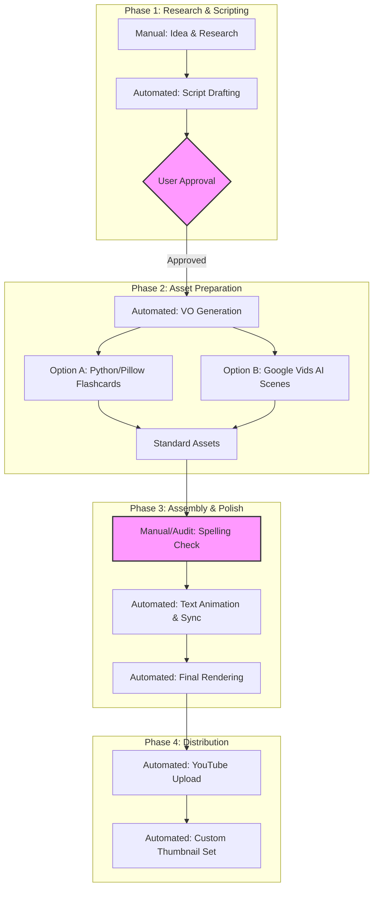

# 🛠️ Punjabi Guftar: Production Loop & System Status

We are pausing all work on PG-003 to perfect the **PG-002 (First Test Video)**. This document outlines our current automation status and the roadmap for recalibrating flashcards and thumbnails.

## 🏗️ Production Flow Chart (Automation vs. Manual)

### 📊 Automation Audit
| Stage | Status | Tool | Intervention Required |
| :--- | :--- | :--- | :--- |
| **Scripting** | 🤖 80% | GPT-4o / Gemini | Research validation & Tone check |
| **Voiceover** | 🤖 100% | Edge-TTS | None (unless quality needs change) |
| **Flashcards** | 🤖 60% | Python/Pillow | **Spelling Audit** & **Animation Sync** |
| **Thumbnail** | 🤖 90% | Python/API | Phone verification (DONE) |
| **Assembly** | 🤖 40% | FFmpeg | Timing sync with VO chunks |

---

## 📜 Git Status (Workspace Integrity)

The repository is currently tracking the core logic. Your newly added assets (Intro/Logo) are currently **Untracked**.

- **Last Commit**: `4beb2c7` - Initial commit: Pipeline established.
- **Current Branch**: `master`
- **Pending Actions**:
    - [ ] Stage and commit standard assets (Intro/Logo/Fonts).
    - [ ] Stage and commit automation script updates.

---

## 🎯 Immediate Recalibration Goals (PG-002)

1.  **Spelling Audit**: I will compare `test_02_alphabets.md` with the existing flashcards to catch discrepancies.
2.  **Text Animation**: I will modify the assembly script to use FFmpeg's `drawtext` for per-character or per-word appearing effects (synchronized with VO timestamps).
3.  **Thumbnail Test**: I will run a dedicated test to set a custom thumbnail for the PG-002 upload to verify the phone activation.

---
